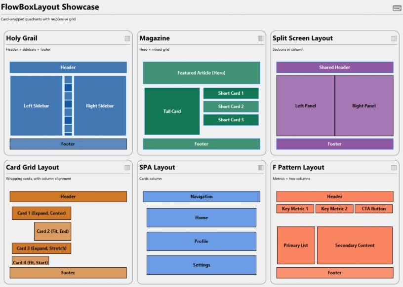
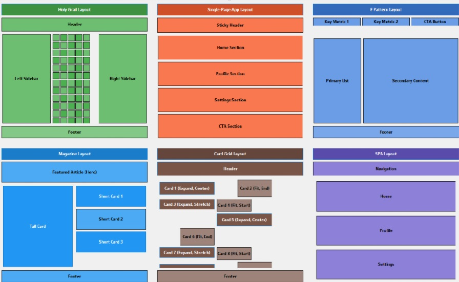

# README.md

# FlowBoxLayout (U++)

A tiny, dependency-free **flow layout** control for Ultimate++ (U++). Arrange children left→right (rows) or top→bottom (column), with optional wrapping, fixed columns/rows, expand/fit/fixed sizing per item, spacers, and per-item cross-axis alignment. Comes with two demos:

* **CardDemo** – FlowBoxLayout embedded in a “StageCard” container (nice visuals + built-in scrolling)
* **FlowDemo** – Raw FlowBoxLayout usage without the card; minimal and framework-agnostic inside U++

---

## Why?

U++ has powerful layout tools, but sometimes you just want a **predictable, flexible flow**:

* Horizontal flow with **wrapping** that feels like CSS flex-wrap
* **Fixed column** grids (Pinterest-style card widths) or **fixed row** stacks
* Per-item **Fixed / Fit / Expand** sizing and **min/max** caps
* Simple **spacers** and **hard breaks** to control rows
* **Cross-axis alignment** (Stretch/Start/Center/End) per item
* **Debug overlay** to visualize insets, rows and item rects

---

## Features at a glance

* Direction: **H** (rows, optional wrap) or **V** (stack)
* Sizing modes: **Fixed(px)**, **Fit()** (child min size), **Expand(weight)**
* Caps: **Min/Max width/height** per item
* Container knobs: **SetWrap**, **SetWrapAutoResize**, **SetWrapRowsExpand**
* Global caps: **SetFixedColumn(px)** (H) and **SetFixedRow(px)** (V)
* Spacing: **SetInset(...)**, **SetGap(px)**
* **AddSpacer()** and **AddBreak()** (newline in H+wrap)
* Tiny min-size cache; no per-layout heap churn
* Self-contained header: `#include <FlowBoxLayout/FlowBoxLayout.h>`

---

## Quick start

```cpp
#include <CtrlLib/CtrlLib.h>
#include <FlowBoxLayout/FlowBoxLayout.h>
using namespace Upp;

struct App : TopWindow {
    FlowBoxLayout fb{ FlowBoxLayout::H };
    Label a, b, c, d;

    App() {
        Title("FlowBoxLayout demo"); Sizeable().Zoomable();
        Add(fb.SizePos());

        fb.SetWrap(true)                 // enable horizontal wrapping
          .SetFixedColumn(DPI(180))      // card-like fixed columns
          .SetGap(DPI(8))                // gutters
          .SetInset(DPI(8), DPI(8))      // padding
          .SetAlignItems(FlowBoxLayout::Stretch);

        a.SetText("A"); b.SetText("B"); c.SetText("C"); d.SetText("D");

        fb.Add(a).Fit();                 // use intrinsic min width
        fb.Add(b).Expand(2);             // share leftover space
        fb.AddBreak();                   // force new row
        fb.Add(c).Fixed(DPI(120));       // exact width
        fb.Add(d).Expand(1).MinMaxHeight(DPI(40), INT_MAX);
    }
};

GUI_APP_MAIN { App().Run(); }
```

---

## API cheat-sheet

**Container configuration**

* `SetDirection(H|V)` – horizontal rows (H) or vertical stack (V)
* `SetWrap(bool)` – enable row wrapping (H only)
* `SetWrapAutoResize(bool)` – report natural height **as a function of width** (parents can size/scroll correctly)
* `SetWrapRowsExpand(bool)` – when there’s extra height, *rows grow* to consume it (H+wrap)
* `SetAlignItems(Align)` – default cross-axis alignment (Stretch/Start/Center/End)
* `SetFixedColumn(px)` – hard width cap per item (H)
* `SetFixedRow(px)` – hard height cap per item (V)
* `SetInset(...)`, `SetGap(px)` – container padding and inter-item gap
* `SetDebug(bool)` – draw overlay for inset/rows/item rects

**Add items**

* `Add(ctrl)` – default **Expand(1)**
* `AddExpand(ctrl, weight)` – explicit expand weight
* `AddFixed(ctrl, px)` – exact size on main axis
* `AddFit(ctrl)` – use child min size on main axis
* `AddSpacer(weight)` – expanding spacer (or one “cell” with fixed columns)
* `AddBreak()` – newline when wrap is on (H), flexible gap otherwise

**Per-item tuning** (via returned `ItemRef`)

* `.Expand(w)`, `.Fixed(px)`, `.Fit()`
* `.MinMaxWidth(min,max)`, `.MinMaxHeight(min,max)`
* `.AlignSelf(Align)`

---

## Demos

### 1) CardDemo (with StageCard)

A polished showcase that wraps FlowBoxLayout inside a **StageCard** container (header, rounded frame, integrated vertical scrollbar). Demonstrates several patterns:

* **Holy Grail** (header + sidebars + footer)
* **Magazine** (hero + mixed grid)
* **Split Screen** (two panels under shared header)
* **Card Grid** (wrapping cards, alignment variants)
* **SPA Layout** (column of sections)
* **F-Pattern** (metrics stripe + two columns)

**Screenshot**



**Run**
Open **`examples/CardDemo`** in TheIDE (or build with `umk`) and run.

---

### 2) FlowDemo (no card)

A minimal window hosting **only FlowBoxLayout**. Showcases wrapping, fixed columns, spacers, row breaks, and per-item alignment without bringing in StageCard.

**Screenshot**



**Run**
Open **`examples/FlowDemo`** in TheIDE (or build with `umk`) and run.

---

## Building

### With TheIDE

1. Add this package to your assembly or open the included `.upp` project.
2. Ensure the demo references U++ packages: `CtrlLib`, `Painter` (and `StageCard` for CardDemo).
3. Build & run.

### With `umk` (CLI)

```bash
# from the repo root (adjust OUT and flags to your platform/toolchain)
umk examples/FlowDemo  .  OUT/FlowDemo  -br -O2
umk examples/CardDemo  .  OUT/CardDemo  -br -O2
```

---

## Notes on scrolling

FlowBoxLayout can report a **natural height** as width changes (`SetWrapAutoResize(true)`), allowing parents to decide when to show a scrollbar. The **CardDemo** uses StageCard, which negotiates scroll automatically; **FlowDemo** relies on the hosting window.

---

## License

MIT (see `LICENSE`).

---

## Contributing

Issues and PRs welcome. Please keep the API small and predictable. Add tests/mini-demos when changing layout semantics.

---

